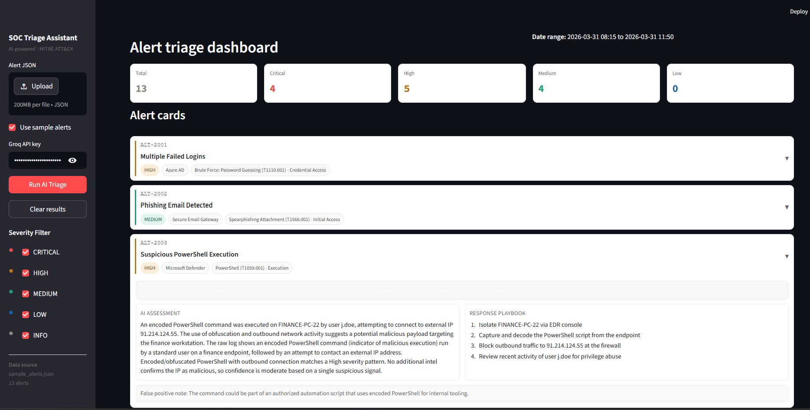

# AI SOC Triage Assistant

## 🛡 Overview

AI-assisted SOC triage prototype that analyzes security alerts with an LLM, enforces validation guardrails, maps to MITRE ATT&CK, and presents results in a Streamlit dashboard.

This project is designed to demonstrate safe, structured AI usage in SOC workflows.



## ⚙️ Workflow

- Ingests JSON security alerts (`sample_alerts.json` or uploaded JSON in the dashboard).
- Sanitizes untrusted alert text before sending it to the LLM.
- Uses Groq LLM inference to produce structured triage output.
- Validates output quality using deterministic guardrails.
- Verifies MITRE tactic/technique consistency against `mitre_mapping.json`.
- Returns a safe fallback response when parsing or validation fails.
- Displays triage results in a filterable Streamlit dashboard.

## 📦 Core Output Schema

Each triaged alert returns:

- `alert_id`
- `incident_summary`
- `severity`
- `confidence`
- `mitre_tactic`
- `mitre_technique`
- `reasoning`
- `recommended_actions`
- `escalation_required`
- `false_positive_note`

## 🧭 Architecture

1. Alert input (`sample_alerts.json` or uploaded file)
2. Input sanitization (`llm_engine.py` + `config.py`)
3. LLM triage generation (Groq)
4. JSON parsing and schema checks
5. Guardrail validation (`guardrails.py`)
6. MITRE mapping validation (`mitre_mapping.json`)
7. Safe fallback on failure
8. UI presentation (`streamlit_app.py`)

## 🗂 Project Structure

- `streamlit_app.py`: dashboard UI and triage orchestration
- `llm_engine.py`: LLM call path, sanitization, parse handling
- `guardrails.py`: deterministic output validation and fallback logic
- `prompt.py`: system prompt with strict output contract
- `config.py`: sanitization patterns and safety constants
- `mitre_mapping.json`: expected MITRE mappings by alert type
- `sample_alerts.json`: synthetic alert dataset
- `test_llm.py`: CLI runner for batch triage output

## 🚀 Setup

### 1. Install dependencies

```bash
pip install -r requirements.txt
```

### 2. Configure environment variables

Create a `.env` file in the project root:

```env
GROQ_API=<your_groq_api_key>
MODEL=llama-3.3-70b-versatile
```

### 3. Run dashboard

```bash
streamlit run app.py
```

## 🔐 Security and Safety Design

- Treats alert data as untrusted input.
- Sanitizes prompt-injection-like phrases before model inference.
- Removes control characters and caps field length sent to model.
- Uses strict output schema expectations.
- Applies deterministic guardrails before accepting model output.
- Falls back to manual-review-safe output when uncertain.

## 📈 Current Status

This is a strong prototype for AI-assisted SOC triage workflows.

Implemented:

- LLM triage with guardrails
- MITRE ATT&CK mapping validation
- Input sanitization
- Streamlit analyst-facing dashboard

## ⚠️ Known Limitations

- Synthetic dataset only (`sample_alerts.json`).
- LLM outputs are probabilistic and can vary by run/model version.
- Guardrails improve safety but do not eliminate false positives/negatives.
- MITRE mapping depends on configured alert-type mapping coverage.

## ✅ Recommended Next Steps

1. Add an evaluation runner for severity/MITRE/escalation accuracy and fallback rate.
2. Add mocked or real API integrations (SIEM ingest, ticket creation).
3. Add unit tests for sanitization and guardrail edge cases.
